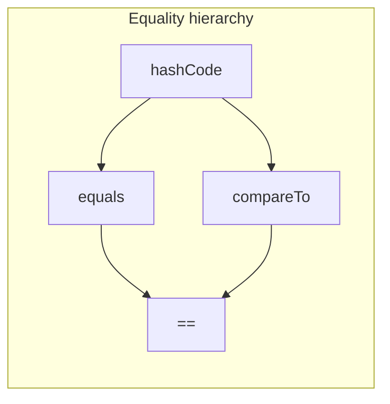

>[Pages Home](Home.md)

# Object Equality in Java

## See also

- [String Intern](StringIntern.md)

There are four things you need to know to understand object equality in Java:

1. `hashCode()` method
2. `compareTo()` method
3. `equals()` method
4. `==` operator

## The hierarchy of object equality

The lower you go, the stronger the equality.

So if two objects are equal according to `==`, then they are also equal according to `equals()`, `compareTo()`, and `hashCode()`.

That is, the `equals()` method returns `true`, the `compareTo()` method returns `0`, and the `hashCode()` method returns the same value for both objects.

## Hash Code

A hash code is a number that is used to identify an object.

It is used to store objects in a hash table.
For example, the `HashMap` class uses hash codes to store objects in a hash table.
It is computed by calling the `hashCode()` method of the object.
It is defined in the `Object` class.
When you call `hashCode()` on an object, it returns an integer value which is the hash code.

You can override it in your class to return a hash code that is more appropriate for your class.
For example, the `String` class overrides it to return a hash code that is computed from the contents of the string.

From the Java API documentation for the [hashCode()](<https://docs.oracle.com/en/java/javase/17/docs/api/java.base/java/lang/Object.html#hashCode()>) method:

> As far as is reasonably practical, the hashCode method defined by class Object returns distinct integers for distinct objects.

## The `equals()` method

The `equals()` method is defined in the `Object` class.
Unless overridden, it compares two objects to see if they are the same object.
Note that it is overridden in the `String` class to compare the contents of the strings.

If two objects are equal, that is if `object1.equals(object2)` returns `true`, then the `hashCode()` method must return the same value for both objects.

You can override it in your class to compare the contents of the objects, but you must also override the `hashCode()` method to return the same value for two objects that are equal.

From the Java API documentation for [equals()](<https://docs.oracle.com/en/java/javase/17/docs/api/java.base/java/lang/Object.html#equals(java.lang.Object)>) method:

> API Note:
>
> It is generally necessary to override the hashCode method whenever this method is overridden, so as to maintain the general contract for the hashCode method, which states that equal objects must have equal hash codes.

> Implementation Requirements:
>
> The equals method for class Object implements the most discriminating possible equivalence relation on objects; that is, for any non-null reference values x and y, this method returns true if and only if x and y refer to the same object (x == y has the value true). In other words, under the reference equality equivalence relation, each equivalence class only has a single element.

## The `compareTo()` method

If two objects are equal, that is if `object1.equals(object2)` returns `true`, then the `compareTo()` method should return 0.

From Java API doc for [compareTo](<https://docs.oracle.com/en/java/javase/11/docs/api/java.base/java/lang/Comparable.html#compareTo(T)>) method:

> It is strongly recommended, but not strictly required that (x.compareTo(y)==0) == (x.equals(y))

## The `==` operator

The `==` operator compares two objects to see if they are the same object.
If you assign the same object to two variables, then the two variables are equal according to `==`.
That is, `object1 == object2` returns `true`.

>[Pages Home](Home.md)